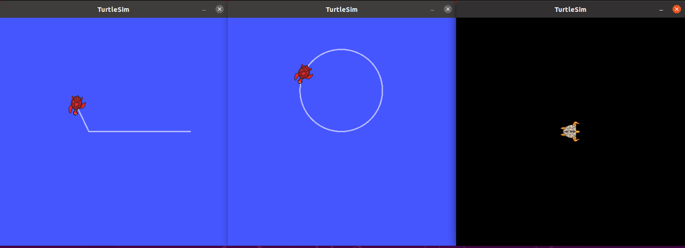
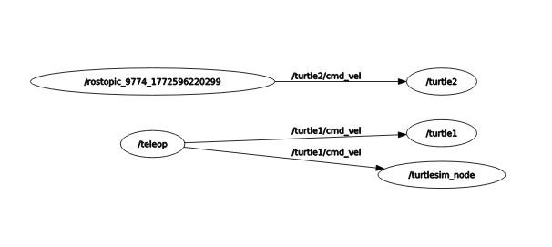

# 🐢 ROS Noetic Study

> Ubuntu 20.04 + VMware 환경에서 ROS Noetic을 처음부터 설정하고 실습한 학습 기록입니다.

---

## 🛠️ 개발 환경

| 항목 | 버전 |
|------|------|
| OS | Ubuntu 20.04 LTS |
| 가상머신 | VMware Workstation |
| ROS | Noetic Ninjemys |
| Python | Python 3 |
| 에디터 | VS Code |

---

## 📦 설치 목록

- ✅ ROS Noetic Desktop Full
- ✅ Git + GitHub SSH 등록
- ✅ VS Code + ROS / C++ / Python / GitLens Extension
- ✅ Catkin 워크스페이스 구성
- ✅ Terminator (터미널 분할 도구)

---

## 📁 패키지 구조
```
catkin_ws/
├── src/
│   ├── my_tutorial/
│   │   ├── scripts/
│   │   │   ├── publisher.py
│   │   │   └── subscriber.py
│   │   └── launch/
│   │       ├── my_tutorial.launch
│   │       ├── multi_turtle.launch
│   │       ├── color_turtle.launch
│   │       └── full_turtle.launch
│   └── beginner_tutorials/
│       ├── msg/
│       │   └── Num.msg
│       ├── srv/
│       │   └── AddTwoInts.srv
│       └── scripts/
│           ├── talker.py
│           ├── listener.py
│           ├── add_two_ints_server.py
│           └── add_two_ints_client.py
```

---

## 📚 학습 내용

### 1️⃣ Topic 통신 — Publisher & Subscriber
```
Publisher ──────────────→ Subscriber
         hello world 계속 전송
```

- **특징**: 1:N 통신, 단방향, 응답 없음
- **활용**: 센서 데이터, 카메라 영상, 위치 정보 전송
```bash
roslaunch my_tutorial my_tutorial.launch
```

---

### 2️⃣ Service 통신 — Server & Client
```
Client ──요청(3+5)──→ Server
Client ←──응답(8)──── Server
```

- **특징**: 1:1 통신, 양방향, 응답 필수
- **활용**: 명령 실행, 계산 요청, 상태 조회
```bash
roslaunch beginner_tutorials service.launch
```

---

### 3️⃣ roslaunch 실습

#### 거북이 2마리 독립 제어


```bash
roslaunch my_tutorial multi_turtle.launch
```

- `turtle1` → 키보드(teleop)로 제어
- `turtle2` → rostopic pub으로 독립 제어

---

#### rqt_graph — 노드 관계 시각화


```bash
roslaunch my_tutorial full_turtle.launch
```

---

### 4️⃣ 커스텀 msg & srv
```bash
rosmsg show beginner_tutorials/Num
# int64 num

rossrv show beginner_tutorials/AddTwoInts
# int64 a
# int64 b
# ---
# int64 sum
```

---

## 📌 Topic vs Service 비교

| | Topic | Service |
|--|-------|---------|
| 방향 | 단방향 | 양방향 |
| 연결 | 1:N | 1:1 |
| 응답 | ❌ | ✅ |
| 흐름 | 지속적 | 1회성 |
| 활용 | 센서, 영상 | 명령, 계산 |

---

## 🔑 핵심 명령어 정리
```bash
cd ~/catkin_ws && catkin_make   # 빌드
rosrun [패키지] [노드]           # 노드 실행
roslaunch [패키지] [launch파일]  # launch 실행
rostopic list                   # 토픽 목록
rostopic echo /[토픽명]          # 토픽 내용
rosnode list                    # 노드 목록
rqt_graph                       # 노드 시각화
rosrun rqt_console rqt_console  # 로그 모니터링
```

---

## 👤 Author

- **GitHub**: [@parkmin-je](https://github.com/parkmin-je)
- **Email**: alswp6@naver.com